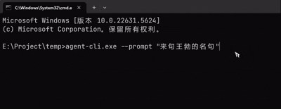
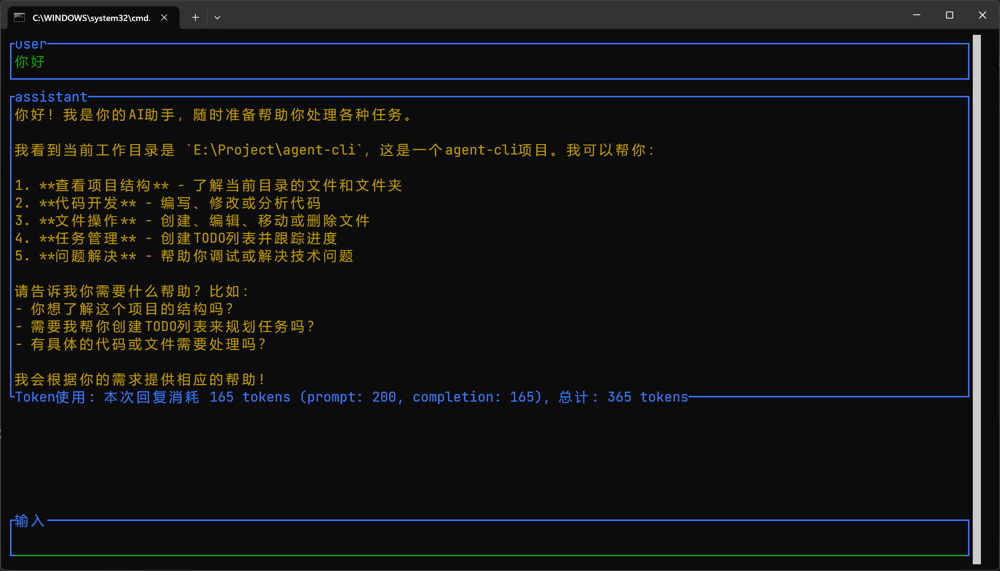

# 🔧 Agent CLI - MCP协议命令行AI工具

* 一个轻巧的基于 rust 的 mcp client
* 一个基于MCP(Model Context Protocol)协议的命令行AI工具，提供流式聊天交互和工具调用功能。
* 支持 NapCat 连接 QQ

[English Version](docs/README_EN.md).

## 示例




## 功能特性

- ✨ 实时流式聊天响应
- ✨ 支持MCP工具调用和推理过程显示
- ✨ 可配置的MCP服务器连接
- ✨ 基于Rust构建，高性能且可靠
- ✨ 支持命令行交互式界面
- ✨ 作为服务端与 NapCat 连接响应 QQ @对话

## 🔧 内部工具

Agent CLI 内置了以下内部工具，可直接在聊天中使用：

| 工具名称 | 描述 | 主要功能 |
|---------|------|---------|
| `filesystem` | 文件系统操作工具 | 读取、写入、列出文件和目录，默认只能操作当前工作目录下的文件 |
| `get_best_tool` | 获取最佳工具推荐 | 根据用户需求分析并推荐最合适的可用工具 |
| `choose_tool` | 工具选择器 | 告诉系统和用户应该使用的最合适的工具（通常由 `get_best_tool` 内部调用） |

这些工具在程序启动时自动启用，无需额外配置。

## 📦 安装指南

### 从源码安装

1. 确保已安装Rust
2. 克隆仓库：
   ```bash
   git clone https://github.com/your-repo/agent-cli.git
   ```
3. 编译项目（NapCat 默认不编译，需要加上参数 --features napcat）：
   ```bash
   cd agent-cli
   cargo build --release
   ```
4. 二进制文件位于`target/release/agent-cli`

5. 将 config_temp.json 改名为 config.json，填入你在 deepseek 官网注册的 api_key，确保你的本地有 config.json、log4rs.yaml 两个文件
   如果你需要使用 napcat，运行的时候加上参数 `--napcat`，然后将 napcat_temp.toml 改名为 napcat.toml，它将只处理配置中的 target_qq 发送的信息

## 💬 使用说明

基本聊天交互：
```bash
agent-cli -p "您的问题或指令"
```

## ⚙️ 配置方法

配置文件位于`config.json`，具体配置参考 `config_temp.json` 文件

## 参数说明

* --promp 用户输入，不填则进入命令行交互 UI 模式
* --stream 是否流式，默认为 true
* --use_tool 是否使用工具，默认为 true
* --wait 等待模式，默认为 false。当为 true 时，程序会在循环中处理标准输入，每次对话不保存上下文
* --remote 启动远程TCP服务器，指定监听地址（如 `127.0.0.1:8080`）

## 🌐 Remote 模块 - 外部对接指南

Agent CLI 提供了 Remote 模块，允许外部应用程序通过 TCP 协议与 AI 模型进行交互。该模块支持多种输入类型和配置选项，方便集成到其他系统中。

### 快速开始

1. **启动远程服务器**：
   ```bash
   agent-cli --remote 127.0.0.1:8080
   ```

2. **客户端连接示例**（Python）：
   ```python
   import socket
   import json

   def send_request(request_data):
       with socket.socket(socket.AF_INET, socket.SOCK_STREAM) as s:
           s.connect(('127.0.0.1', 8080))
           request_json = json.dumps(request_data) + '\n'
           s.sendall(request_json.encode('utf-8'))
           response = s.recv(4096).decode('utf-8')
           return json.loads(response)

   # 发送请求
   response = send_request({
       "request_id": "test_001",
       "input": {"Text": "你好"},
       "stream": False,
       "use_tools": True
   })
   print(response)
   ```

### 详细协议文档

完整的通讯协议文档请参考：[docs/remote_protocol.md](docs/remote_protocol.md)

文档内容包括：
- 完整的协议规范
- 所有消息格式定义
- 多种输入类型支持（文本、图像、文件、指令等）
- 配置选项说明
- 使用示例
- 客户端实现指南（Python、JavaScript等）
- 错误处理和性能建议

### 主要特性

- **多种输入类型**：支持文本、图像（base64）、文件、结构化指令
- **流式响应**：支持实时流式输出
- **工具调用**：可配置是否使用MCP工具
- **配置覆盖**：支持请求级别的配置自定义
- **Token统计**：返回详细的token使用情况

### 集成场景

- **Web应用后端**：作为AI服务提供者
- **桌面应用**：集成AI功能
- **自动化脚本**：批量处理任务
- **监控系统**：智能告警分析
- **教育工具**：智能辅导系统

## 👨‍💻 开发指南

### 编译

```bash
cargo build
```

### 运行测试

```bash
cargo test
```
或直接双击运行“运行Target.bat”

### 日志设置
在 `log4rs.yaml` 中设置日志等级、输出

## 📜 许可证

[GPL_V3](LICENSE)
