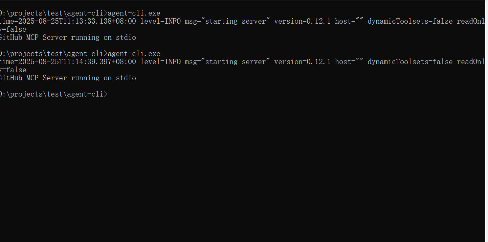

# 🔧 Agent CLI - MCP协议命令行AI工具

* 一个基于MCP(Model Context Protocol)协议的命令行AI工具，提供流式聊天交互和工具调用功能。
* 支持 NapCat 连接 QQ

[English Version](#english-version)

## 示例




## 功能特性

- ✨ 实时流式聊天响应
- ✨ 支持MCP工具调用和推理过程显示
- ✨ 可配置的MCP服务器连接
- ✨ 基于Rust构建，高性能且可靠
- ✨ 支持命令行交互式界面
- ✨ 作为服务端与 NapCat 连接响应 QQ @对话

## 📦 安装指南

### 从源码安装

1. 确保已安装Rust(推荐1.70+版本)
2. 克隆仓库：
   ```bash
   git clone https://github.com/your-repo/agent-cli.git
   ```
3. 编译项目（NapCat 默认不编译，需要加上参数 --features napcat）：
   ```bash
   cd agent-cli
   cargo build --release
   ```
4. 二进制文件位于`target/release/agent-cli`

## 💬 使用说明

基本聊天交互：
```bash
agent-cli -p "您的问题或指令"
```

## ⚙️ 配置方法

配置文件位于`config.json`，具体配置参考 `config_temp.json` 文件

## 参数说明

* --promp 用户输入，不填则进入命令行交互 UI 模式
* --stream 是否流式，默认为 true
* --use_tool 是否使用工具，默认为 true

## 👨‍💻 开发指南

### 编译

```bash
cargo build
```

### 运行测试

```bash
cargo test
```

### 日志设置
在 `log4rs.yaml` 中设置日志等级、输出

## 📜 许可证

[GPL_V3](LICENSE)

<a name="english-version"></a>
## English Version

For English documentation, please refer to [README_EN.md](README_EN.md).
