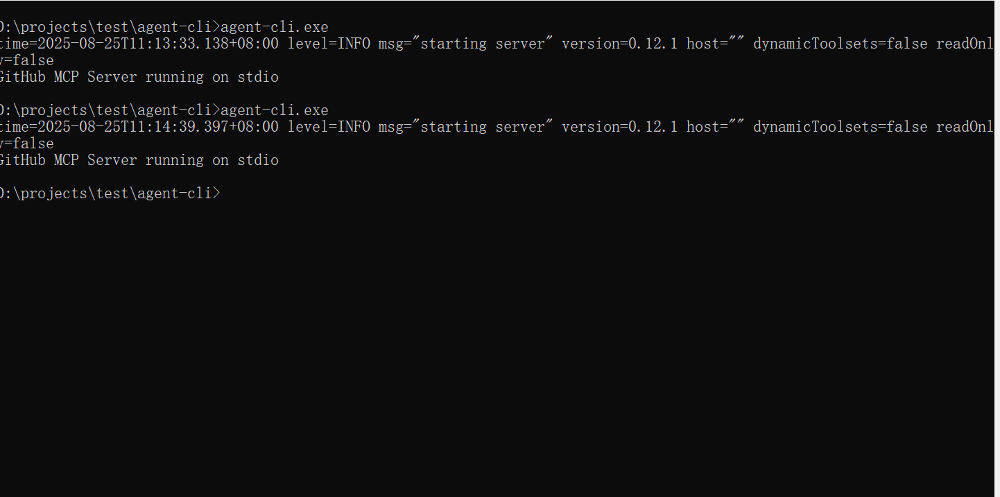

# 🔧 Agent CLI - MCP Protocol Command Line AI Tool

* a simple mcp client make by rust
* A command-line AI tool based on the MCP (Model Context Protocol) protocol, providing streaming chat interaction and tool calling functionality.
* Supports NapCat connection to QQ

[中文版本](README.md).

## Examples




## Features

- ✨ Real-time streaming chat responses
- ✨ Supports MCP tool calling and reasoning process display
- ✨ Configurable MCP server connections
- ✨ Built with Rust, high performance and reliable
- ✨ Supports command-line interactive interface
- ✨ Acts as a server to connect with NapCat and respond to QQ @mentions

## 📦 Installation Guide

### Install from Source

1. Ensure Rust is installed (recommended version 1.70+)
2. Clone the repository:
   ```bash
   git clone https://github.com/your-repo/agent-cli.git
   ```
3. Build the project (NapCat is not compiled by default, need to add parameter --features napcat):
   ```bash
   cd agent-cli
   cargo build --release --features napcat
   ```
4. The binary file is located at `target/release/agent-cli`

## 💬 Usage Instructions

Basic chat interaction:
```bash
agent-cli -p "Your question or instruction"
```

## ⚙️ Configuration Method

Configuration file is located at `config.json`, specific configuration reference `config_temp.json` file

## Parameter Description

* --prompt User input, if not provided, enters command-line interactive UI mode
* --stream Whether to use streaming, defaults to true
* --use_tool Whether to use tools, defaults to true

## 👨‍💻 Development Guide

### Build

```bash
cargo build
```

### Run Tests

```bash
cargo test
```

### Log Settings
Set log level and output in `log4rs.yaml`

## 📜 License

[GPL_V3](LICENSE)

<a name="chinese-version"></a>
## Chinese Version

