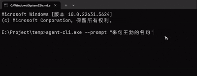

# 🔧 Agent CLI - MCP Protocol Command Line AI Tool

A command-line AI tool based on the MCP (Model Context Protocol) protocol, providing streaming chat interaction and tool calling functionality.

## Demo


## Features

- ✨ Real-time streaming chat responses
- ✨ Support for MCP tool calling and reasoning process display
- ✨ Configurable MCP server connections
- ✨ Built with Rust, high performance and reliable

## 📦 Installation Guide

### Install from Source

1. Ensure Rust is installed (recommended version 1.70+)
2. Clone the repository:
   ```bash
   git clone https://github.com/your-repo/agent-cli.git
   ```
3. Build the project:
   ```bash
   cd agent-cli
   cargo build --release
   ```
4. The binary file is located at `target/release/agent-cli`

## 💬 Usage Instructions

Basic chat interaction:
```bash
agent-cli -p "Your question or instruction"
```

## ⚙️ Configuration

Configuration file is located at `config.toml`, configurable options include:
- Default MCP servers
- deepseek_key

## Parameters

* promp User input, required
* stream Whether to use streaming, defaults to true

## 👨‍💻 Development Guide

### Build

```bash
cargo build
```

### Run Tests

```bash
cargo test
```

### Log Settings

Set log level via environment variables:
```bash
RUST_LOG=debug agent-cli --prompt "Your prompt"
```

## 📜 License

[GPL_V3](LICENSE)
